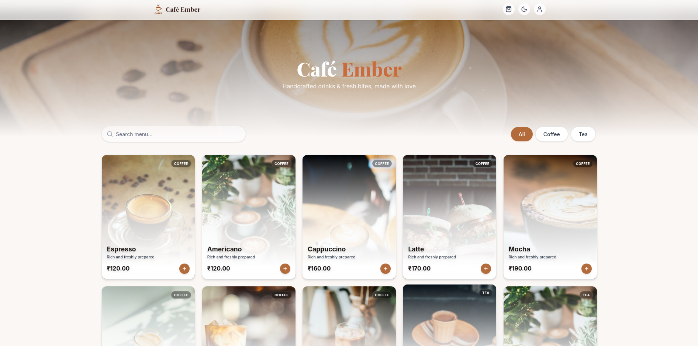
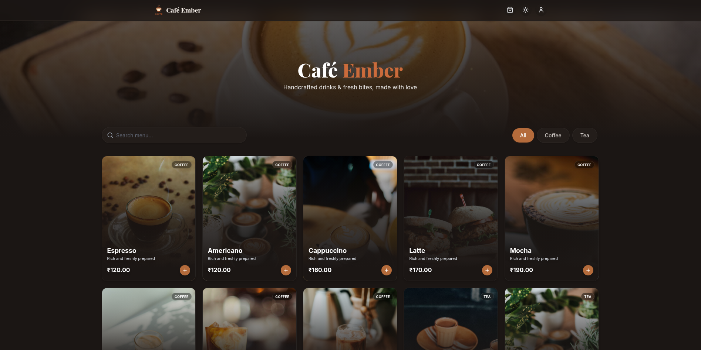
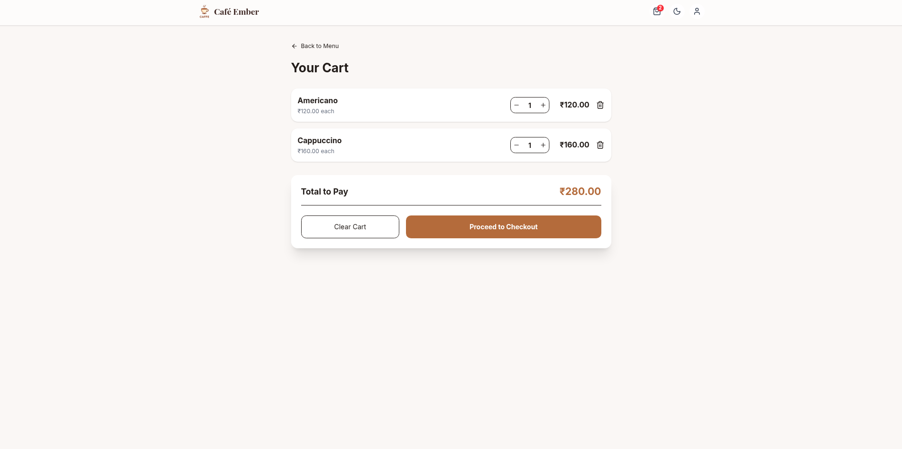
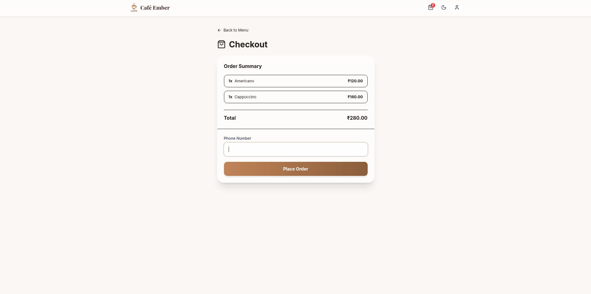
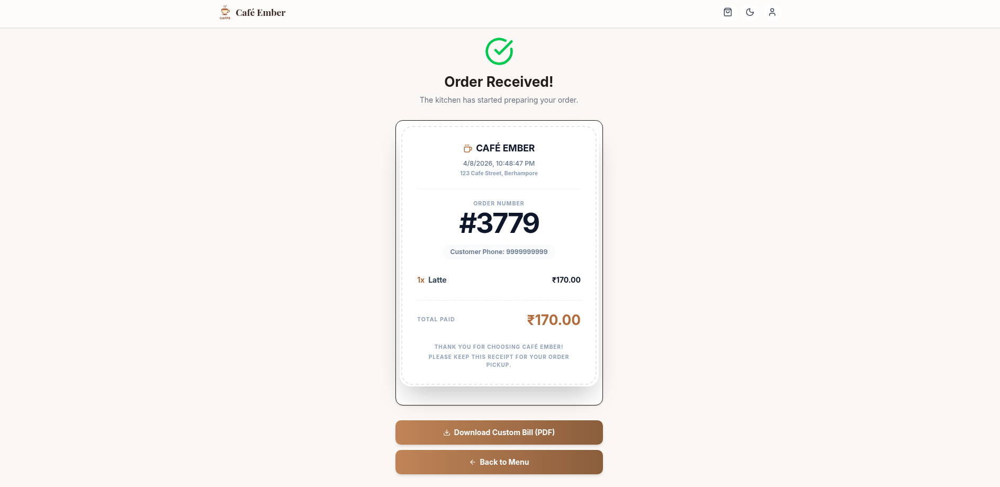
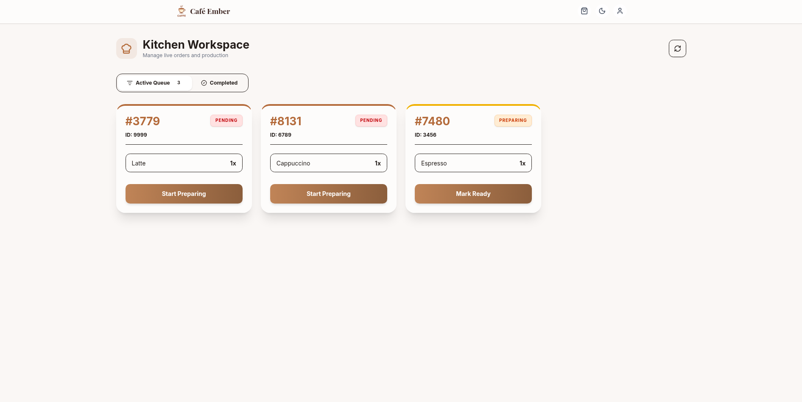
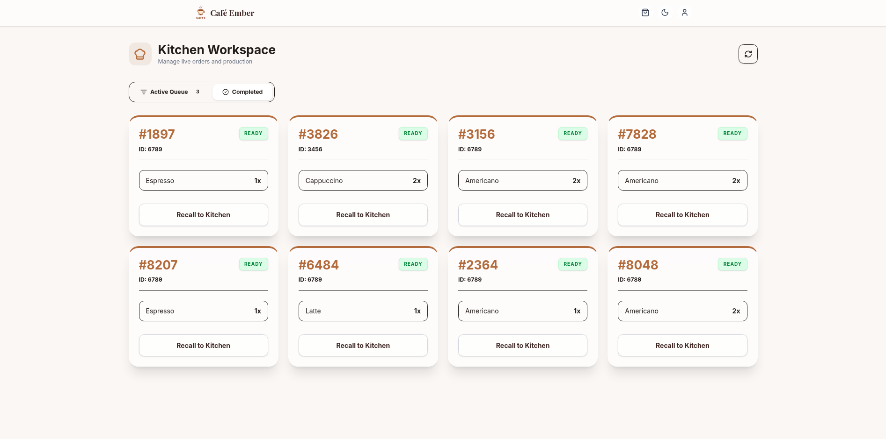
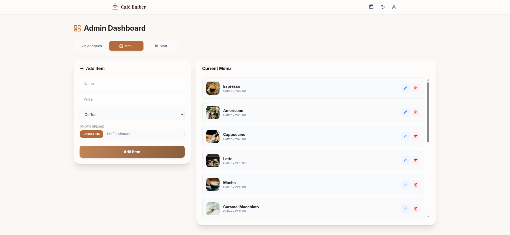
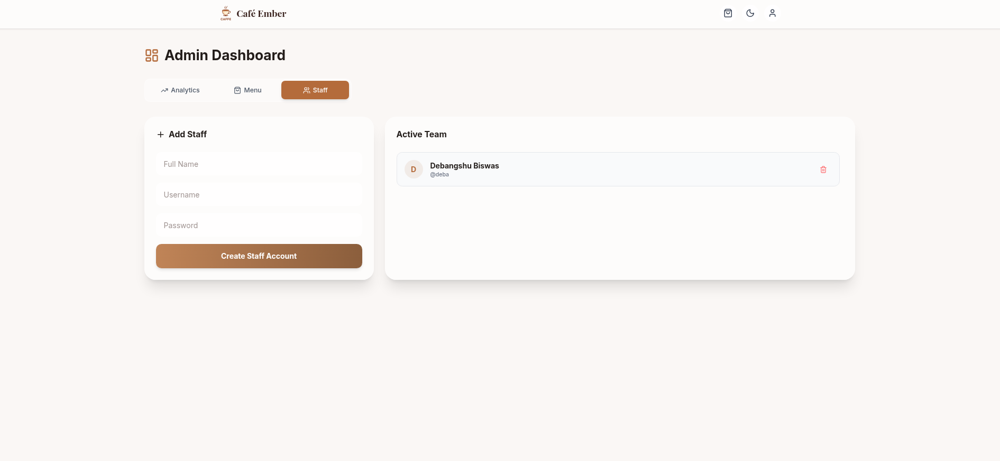

# ☕ Café Ember — Real-Time Cafe Management System

A full-stack cafe management system designed to streamline ordering, kitchen workflow, and administration with real-time updates and a modern UI.

---

## 🚀 Overview

**Café Ember** is a production-style web application that simulates a real-world café ecosystem.
It enables customers to browse menus and place orders, while staff and admins manage operations efficiently through a real-time dashboard.

---

## ✨ Key Features

### 🛒 Customer Side

* Browse dynamic menu with categories & search
* Add items to cart and place orders
* Persistent cart using local storage
* Order history tracking
* Download PDF receipt for orders

### 🔐 Authentication & Security

* JWT-based authentication
* Role-based access control (Admin / Staff / Customer)
* Secure password hashing
* First-time login password reset flow

### 🧑‍🍳 Kitchen / Staff Dashboard

* Real-time order queue (WebSockets)
* Status updates: `Pending → Preparing → Ready → Completed`
* Active & completed order tabs
* Instant synchronization across devices

### 🧑‍💼 Admin Panel

* Manage staff accounts
* Menu CRUD operations with image upload
* Analytics dashboard:

  * Total revenue
  * Total orders
  * Most popular item

### ⚡ Real-Time System

* Socket.IO integration for live kitchen updates
* Event-driven architecture

### 🧾 Billing System

* Dynamic receipt UI
* Convert receipt → image → downloadable PDF

---

## 🏗️ Tech Stack

### Frontend

* React (Vite)
* Tailwind CSS
* Framer Motion
* Lucide Icons

### Backend

* Flask
* MongoDB
* Flask-JWT-Extended
* Socket.IO

### Utilities

* html-to-image
* jsPDF

---

## 🧠 Architecture Highlights

* Modular Flask backend using Blueprints
* Role-based middleware (RBAC)
* MongoDB aggregation pipeline for analytics
* WebSocket-based real-time updates
* Clean component-based React architecture

---

## 📸 Screenshots 


* 🏠 Home / Menu UI
<p align="center">
  
  
</p>
* 🛒 Cart & Checkout
<p align="center">
  
  
</p>
* 🧾 Order Receipt PDF
<p align="center">
  
</p>
* 🧑‍🍳 Kitchen Dashboard
<p align="center">
  
  
</p>
* 📊 Admin Dashboard
<p align="center">
  
  
</p>

---

## ⚙️ Installation & Setup

### 1️⃣ Clone the repository

```bash
git clone https://github.com/your-username/cafe-ember.git
cd cafe-ember
```

### 2️⃣ Backend Setup

```bash
cd backend
pip install -r requirements.txt
```

Create `.env`:

```env
JWT_SECRET_KEY=your_secret_key
```

Run server:

```bash
python run.py
```

---

### 3️⃣ Frontend Setup

```bash
cd frontend
npm install
npm run dev
```

---

## 🔑 Default Admin Login

```
Username: superadmin
Password: admin123
```

---

## 📊 API Highlights

* `POST /api/orders` → Place order
* `GET /api/menu` → Fetch menu
* `POST /api/login` → Authentication
* `GET /api/admin/analytics` → Dashboard stats
* `PUT /api/orders/:id/status` → Update order status

---

## 🎯 What Makes This Project Stand Out

* Real-time system using WebSockets
* Full order lifecycle implementation
* Role-based authentication & authorization
* PDF generation from UI components
* Production-style backend architecture
